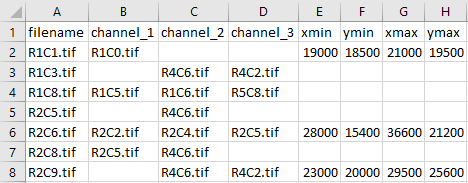

# unmixing_pipeline:

unmixing_pipeline is a tool for unmixing Immunohistochemistry (IHC) images taken in multiple channels and rounds.


## Dependencies:

* numpy
* scipy
* scikit-image
* tiffile
* matplotlib

## Pipeline:

You can run the unmxing pipeline in 2 modes:
1. `main_unsupervised`: In this mode, all the channels of same round are going to be unmixed with
 __sparse spectral unmixing__ algorithm.
 
    ```bash
    python main_unsupervised.py --img_dir=/path/to/input/dir \
                                --save_dir=/path/to/save/dir    
    ``` 
    It will save unmixed images and generate a script of unmixed channels in the `save_dir`:
    

2. `main_supervised`: In this mode, user can correct the script and all the channels provided in the script are going to be unmixed with
 __chemical co-localization unmixing__ algorithm.
 
    
    
    ```bash
    python main_supervised.py --img_dir=/path/to/input/dir \
                              --save_dir=/path/to/save/dir \
                              --script_file=/path/to/script/file   
    ```
    It will save unmixed images in `save_dir`.


## Arguments:

1. `main_unsupervised`:
    
    |Argument|Help|Example|
    |---|---|---|
    |img_dir|path to the directory of images|--img_dir=E:/50_plex/tif|
    |save_dir|path to the directory to save unmixed images|--img_dir=E:/50_plex/tif|
    |default_box|selected box coordinates xmin_ymin_xmax_ymax|--default_box=16200_6100_21300_12200|

2. `main_supervised`:

    |Argument|Help|Example|
    |---|---|---|
    |img_dir|path to the directory of images|--img_dir=E:/50_plex/tif|
    |save_dir|path to the directory to save unmixed images|--img_dir=E:/50_plex/tif|
    |script_file|csv script file name|--script_file=script.csv|
    |default_box|selected box coordinates xmin_ymin_xmax_ymax|--default_box=16200_6100_21300_12200|
    |visualize|visualize the unmixing report of crop|--visualize|

## Notes:

* if `--visualized` passed:
    

